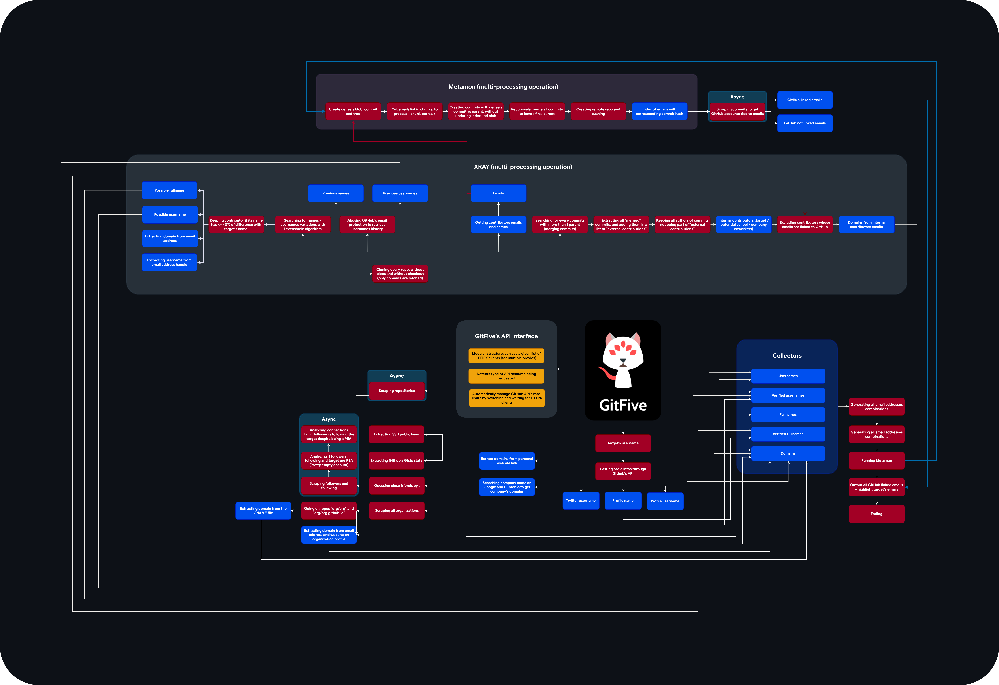

<br>


# Description

GitFive is an OSINT tool to investigate GitHub profiles.

Main features :
- Usernames / names history
- Usernames / names variations
- Email address to GitHub account
- Find GitHub's accounts from a list of email addresses
- Lists identities used by the target
- Clones and analyze every target's repos
- Highlights emails tied to GitHub's target account
- Finds local identities (UPNs, ex : jeanpierre@My-Computer.local)
- Finds potential secondary GitHub accounts
- Don't need repos to work (but better)
- Generates every possible email address combinations and looks for matchs
- Dumps SSH public keys
- JSON export

Optimizations :
- Very low API consumption, stays under the rate-limit
- Multi-processing tasks (bypassing Python's GIL)
- Async scraping

# Workflow
**Click [here](https://user-images.githubusercontent.com/17338428/194182901-b062b2cf-c02c-40f0-854a-5f3c52031271.png) for a full view**

<br>



# Requirements
- Git
- Python >= 3.10

# Installation

```bash
$ pip3 install pipx
$ pipx ensurepath
$ pipx install gitfive
```
It will automatically use venvs to avoid dependency conflicts with other projects.

# Usage
First, login to GitHub *(preferably with a secondary account)* :
```bash
$ gitfive login
```

Then, profit :
```bash
usage: gitfive [-h] {login,user,email,emails,light} ...

positional arguments:
  {login,user,email,emails,light}
    login               Let GitFive authenticate to GitHub.
    user                Track down a GitHub user by its username.
    email               Track down a GitHub user by its email address.
    emails              Find GitHub usernames of a given list of email addresses.
    light               Quickly find emails addresses from a GitHub username.

options:
  -h, --help            show this help message and exit
```


*PS : plz avoid testing on torvalds or other authors of repos with 1 million commits*

📄 You can also use --json with user and email modules to export in JSON ! Example :

```bash
$ gitfive user mxrch --json mxrch_data.json
```

**Have fun 🥰💞**

## Video demo

https://github.com/mxrch/GitFive/assets/17338428/28a22d30-f651-483f-84e8-7fc6e00b831f

## Obvious disclaimer

This tool is for educational purposes only, I am not responsible for its use.

### Less obvious disclaimer

The use of this tool in an automated paid service / software is strictly forbidden without my personal agreement.\
Please use it only in personal, criminal investigations, or open-source projects.

## Thanks

- [novitae](https://github.com/novitae) for being my Python colleague
- [rayanlecat](https://twitter.com/rayanlecat), [ABH](https://twitter.com/ABHsec), [22sh](https://twitter.com/0x22sh), [BlackWasp](https://twitter.com/BlWasp_), [Tartofraise](https://twitter.com/_Tartofraise), [mpgn](https://twitter.com/mpgn_x64), [M3SS](https://twitter.com/0x4D335353) and [n1nj4sec](https://twitter.com/n1nj4sec) for the beta test
- The HideAndSec team 💗 (blog : https://hideandsec.sh)

## Sponsors

Thanks to these awesome people for supporting me !

<!-- sponsors --><a href="https://github.com/BlWasp"></a>&nbsp;&nbsp;<a href="https://github.com/0xN0x"></a>&nbsp;&nbsp;<a href="https://github.com/C3n7ral051nt4g3ncy"></a>&nbsp;&nbsp;<a href="https://github.com/rayanlecat"></a>&nbsp;&nbsp;<a href="https://github.com/ajmeese7"></a>&nbsp;&nbsp;<a href="https://github.com/im-hanzou"></a>&nbsp;&nbsp;<a href="https://github.com/gingeleski"></a>&nbsp;&nbsp;<a href="https://github.com/zourdyzou"></a>&nbsp;&nbsp;<!-- sponsors -->

\
You like my work ?\
[Sponsor me](https://github.com/sponsors/mxrch) on GitHub ! 🤗
